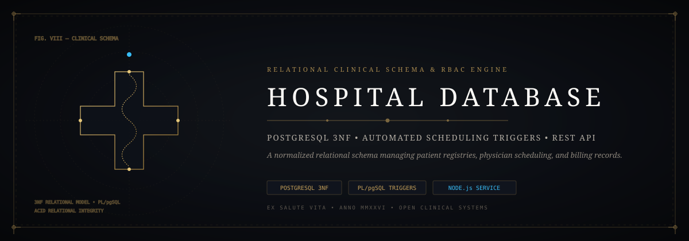
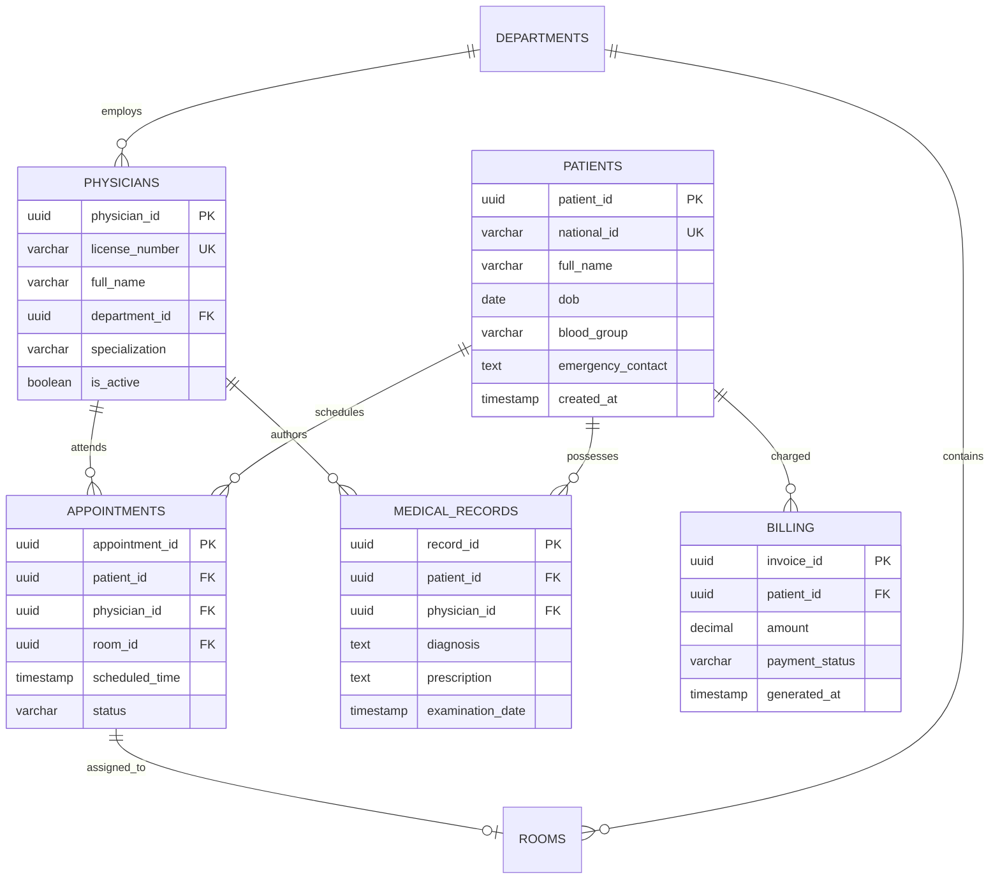
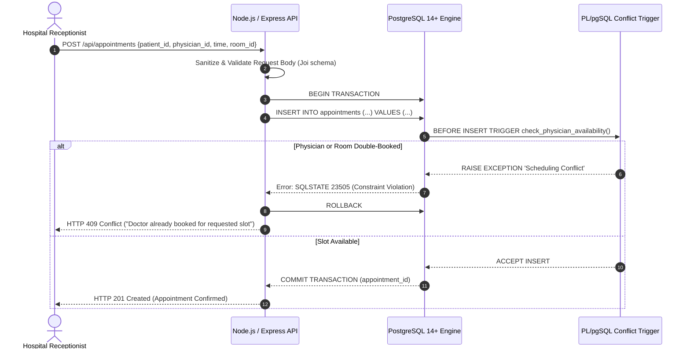

<div align="center">



# 🏥 Hospital Database & Clinical Management System
### *Normalized 3NF Relational Schema, Automated Scheduling Triggers & Clinical RBAC Engine*

[](https://github.com/Jaswanth1902/Hospital-Database)
[](https://github.com/Jaswanth1902/Hospital-Database)
[](https://github.com/Jaswanth1902/Hospital-Database)
[](https://github.com/Jaswanth1902/Hospital-Database)
[](LICENSE)

*A production-grade, 3NF-normalized clinical relational schema with automated PL/pgSQL conflict detection, role-based access control (RBAC), and parameterized SQL query safety.*

</div>

---

## ⚡ The Architectural Vision

Hospital database systems frequently suffer from data redundancy, unindexed clinical queries, appointment scheduling conflicts, and severe SQL injection vulnerabilities. 

**Hospital-Database** delivers a rigorous, mathematically normalized relational architecture:
- **3NF Relational Model**: Eliminates transitive and partial dependencies across patients, doctors, appointments, medical records, and billing ledgers.
- **PL/pgSQL Trigger Engine**: Real-time automated conflict detection preventing overlapping doctor appointments and room double-bookings at the database engine level.
- **Role-Based Access Control (RBAC)**: Fine-grained security views isolating physician clinical notes from billing administrators and public receptionists.
- **AI Query Analytics**: Natural language query translation layer allowing clinical administrators to query bed occupancy and department utilization without writing raw SQL.

---

## 🏗️ Relational Schema Architecture



---

## 🔄 Interaction & Conflict Resolution Sequence



---

## 🧩 Antigravity Skills & Tooling Ecosystem

This repository integrates with the Antigravity agentic skill matrix:

- **`clean-code`**: Strict adherence to Uncle Bob Martin clean code principles and modular separation between database migration scripts and API controllers.
- **`security-linting`**: Zero raw SQL concatenation; automated AST auditing verifying 100% parameterized queries.
- **`performance-profiling`**: `EXPLAIN ANALYZE` query execution plans guaranteeing B-Tree index utilization under high query velocity.
- **`schema-mapping`**: High-fidelity declarative mapping between clinical HL7/FHIR message standards and relational PostgreSQL tables.

---

## 📦 Tech Stack & Dependencies

| Layer | Technology | Purpose |
| :--- | :--- | :--- |
| **Database** | PostgreSQL 14+ | Relational engine, 3NF schema, ACID compliance, PL/pgSQL triggers |
| **API Layer** | Node.js 18+ / Express | RESTful endpoints, connection pooling (`pg-pool`) |
| **Validation** | Joi | Strict payload validation preventing invalid inputs |
| **Security** | bcrypt | Secure password hashing (work factor 12) for clinical staff |
| **Frontend AI** | HTML5 / Modern CSS / Vanilla JS | Responsive clinical workbench for analytics and query inspection |

---

## 🛡️ Security Hardening & Zero-Trust Architecture

1. **100% Parameterized Queries**: All SQL executions utilize parameterized `$1, $2` variables via `pg` connection pool. Zero string interpolation is permitted.
2. **Clinical Data Isolation (RBAC)**: Database roles (`receptionist_role`, `doctor_role`, `billing_role`) enforce strict least-privilege table grants. Medical notes cannot be read by billing accounts.
3. **Secret Hygiene**: Zero database passwords or JWT tokens committed to source. All credentials loaded via validated environment configurations (`.env.example`).
4. **Audit Logging**: Immutable database trigger `clinical_audit_log` records timestamp, operator ID, and field diff for every change to patient records.

---

## 🚀 Getting Started

### 1. Prerequisites
- PostgreSQL 14 or higher
- Node.js 18 or higher

### 2. Database Initialization
```bash
# Create clinical database
createdb -U postgres hospital_db

# Execute schema and triggers
psql -U postgres -d hospital_db -f Database/schema.sql
```

### 3. Backend Setup
```bash
cd Backend
cp .env.example .env
npm install
npm start
```
API server runs at `http://localhost:5000`.

---

## 📄 License & Governance

Distributed under the [MIT License](LICENSE). Maintained by [Jaswanth Reddy](https://github.com/Jaswanth1902) — *Passionate learner & creative problem solver learning from and giving back to the open-source community.*
